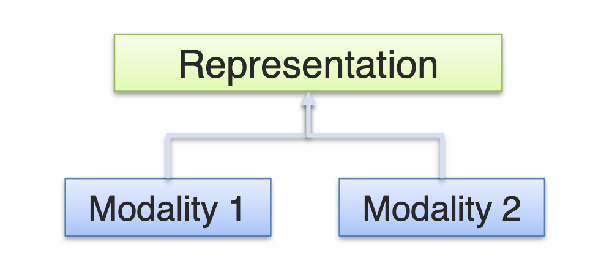
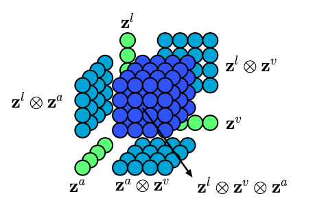

# content_evaluator
By Allison Zhou and Austin Zimmerman

## *THIS PROJECT IS IN PROGRESS, WE WILL BE UPDATING PERIODICALLY AS WE ATTEMPT DIFFERENT STRATEGIES AND OUR RESULTS IMPROVE*
``` 
Current Score on DrivenData (ROC AUC): 0.591
```

Goal: Create an algorithm that identifies multimodal hate speech in internet memes.

From [DrivenData.com](https://www.drivendata.org/competitions/64/hateful-memes/page/206/): 

''' Your goal is to predict whether a meme is hateful or non-hateful. This is a binary classification problem with multimodal input data consisting of the the meme image itself (the image mode) and a string representing the text in the meme image (the text mode).

Given a meme id, meme image file, and a string representing the text in the meme image, your trained model should output the probability that the meme is hateful.
'''

## Data
The data come in .jsonl format, which was loaded into pandas for preprocessing and manipulation.  The **train.jsonl** and **dev.jsonl** files can be translated into a DataFrame with the following columns:

* **id**. The unique identifier between the img directory and the .jsonl files, e.g., "id": 13894.
* **img**. The actual meme filename, e.g., "img": img/13894.png, contains the id.
* **text**. The raw text string embedded in the meme image, e.g., img/13894.png has "text": "putting bows on your pet"
* **label** where 1 -> "hateful" and 0 -> "non-hateful"

**test.jsonl** contains the same fields, except, of course, for the labels.


## Modeling
### Bimodal Early Fusion
We took an "Early Fusion" approach to establish a performance baseline.  In this simplistic approach, the image and text data were vectorized seperately, then combined to form a single input vector for a Multi-Layer-Perceptron (MLP).   

Early Fusion:
<p align="center">
       

#### Image Vectorization:
For image processing, we reduced each image down to a 16x16 color representation (16x16x3), which produced a total vector of length 768.
#### Text Vectorization:
The text was vectorized using SKlearn's TfidfVectorizer.  We used the WordNet Lemmatizer as well as SKlearn's built-in English stop-words list, and set max_features=1000.  This produced a vector for each meme of length 1000.  When combined with the image vector, the total input vector length is 1768.

#### Simple Neural Net
The 'fused' vector was then passed into an MLP with **3 hidden layers** (64 neurons each), **sigmoid** activation function in the output layer, a **binary_crossentropy** loss function, and an **Adam** optimizer.

### Unimodal Voting
We were curous to see how a unimodal approach would compare with the more advanced appraoches.  These attempts were largely unsiccessful, but not uninformative.  They confirmed our suspicions that, when it was possible to identify unimodal hate-speech, it was far more likely to be from the text input than the image input.  Whereas many hateful entries shared common text charactaristics (such as slurs), anything short of a pre-trained, swastika-hunting CNN was not going to prove much use in identifying unimodal hate from images.

#### Clustering

### Tensor Fusion Network (using PyTorch)

At this point, we transitioned from Keras/Tensorflow to PyTorch as our main engine.  A Tensor Fusion Network (TFN) is a multimodal neural net designed to capture the interactions between different data modalities.  A TFN is comprised of a subnetwork for each modality type, a final classification network, and, crucially, a tensor fusion layer that uses the torch.bmm() method to "explicitly model the unimodal, bimodal, and trimodal interactions using a 3-fold Cartesian product from modality embeddings."  With academic inspiration from [this](https://arxiv.org/abs/1707.07250) paper, and pythonic inspiration from this implementation of a TFN.  We set about building and training a TFN that could solve our mutimodal hate-speech problem.

<p align="center">
       
       
**Above: the unimodal (green), bimodal (light blue), and trimodal (dark blue) representations created by the TFN in *Tensor Fusion Network for Multimodal Sentiment Analysis* by Zadeh et. al**

Whereas previous implementations of this technique have utilized trimodal datasets, our use-case was only bimodal.  Our final output resembled the light blue matrices in the image above.  Practically speaking, it was not difficult to adapt the established schema to fit our needs.  Using PyTorch's capable and comfortable functionality, we slimmed the TFN down to a bimodal network and set about getting it to train.

Much like our baseline model, the TFN seemed to be learning a bit, but not with any regularity.  Test AUC would bounce wildly with each pass over the dataset, fluctuating between 0.45 and 0.59.  Despite this relatively poor performance, our team ranks 142/2400 at the time of writing.

#### Next Steps
Upon reviewing our network (and consulting with the author of the above linked GitHub repo).  We feel that it is likely the image-learning that is hamstringing our efforts to get this model to train effectively.  To address this issue the following steps may be appropriate:
* Convert the existing ImageSubNet from an MLP to a CNN.  While an MLP performed well on dataset for which this network was designed, that dataset contained images of faces with very specific areas of activation.  It is likely that a cnn will better capture the necessary detail.
* Adapt the image-processing pipeline to output larger images.  We believe that a 28*28, greyscale representation of these images simply may not be sufficient to capture the signal that exists within them.  A larger size, as well as retaining image color, may help.